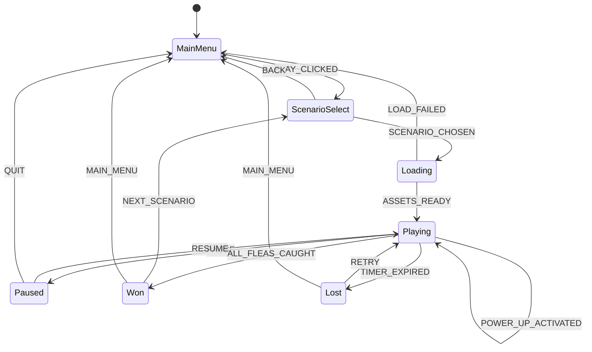
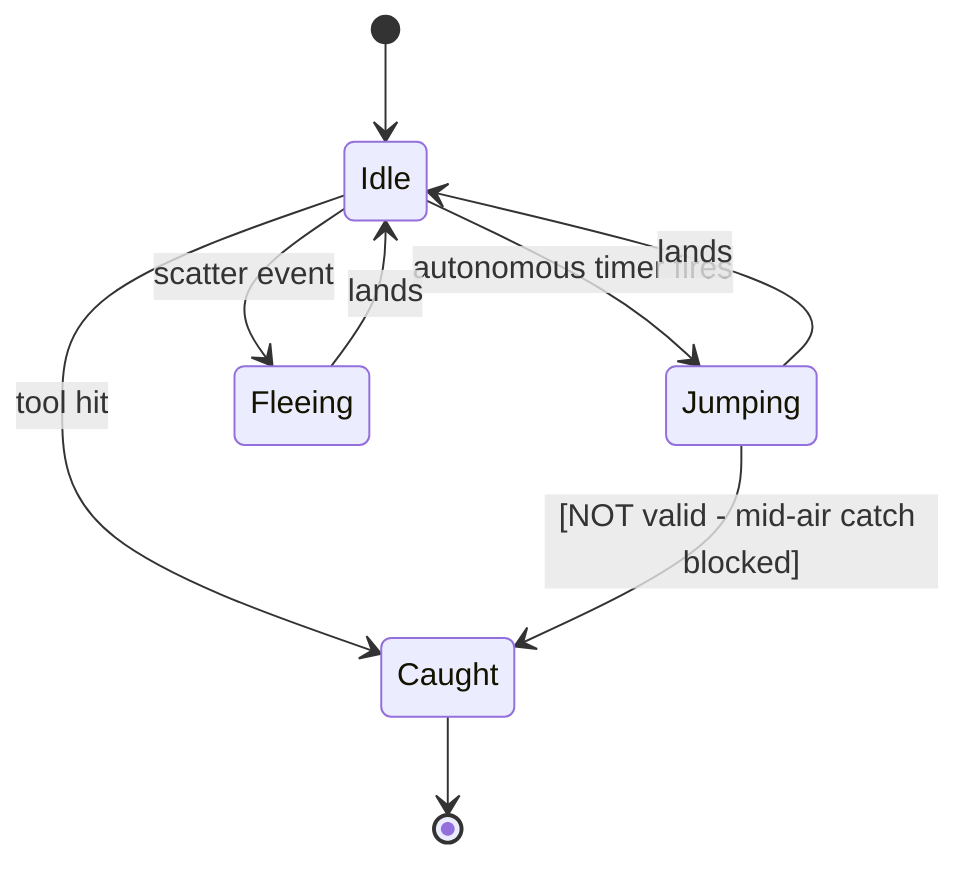
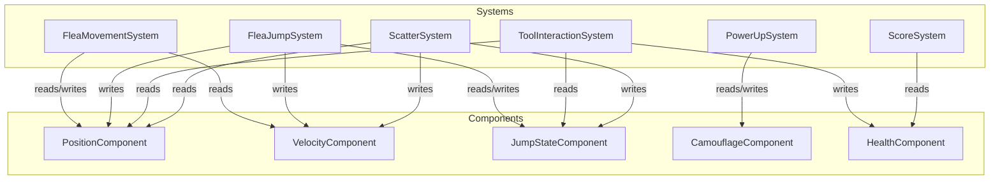
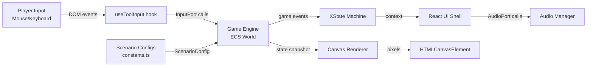

# Flea Picker — Architecture Specification

**Version**: 1.0  
**Date**: 2026-03-05  

---

## 1. High-Level Architecture

```
┌──────────────────────────────────────────────────────────┐
│                      Browser (SPA)                       │
│                                                          │
│  ┌──────────────┐    ┌────────────────────────────────┐  │
│  │  React Shell │◄──►│        XState Machine          │  │
│  │  (UI Layer)  │    │  (Game Session FSM)            │  │
│  └──────┬───────┘    └──────────────┬─────────────────┘  │
│         │                           │                     │
│         ▼                           ▼                     │
│  ┌──────────────┐    ┌────────────────────────────────┐  │
│  │ Canvas Render│◄──►│      Game Engine (pure TS)     │  │
│  │  (Adapter)   │    │  ECS: World / Systems / Loop   │  │
│  └──────────────┘    └──────────────┬─────────────────┘  │
│                                     │                     │
│                       ┌─────────────┼─────────────┐      │
│                       ▼             ▼             ▼       │
│                  ┌─────────┐ ┌─────────┐ ┌──────────┐    │
│                  │ Flea    │ │  Tool   │ │ Scenario │    │
│                  │ System  │ │ System  │ │ Config   │    │
│                  └─────────┘ └─────────┘ └──────────┘    │
│                                                          │
│  ┌──────────────────────────────────────────────────┐    │
│  │              Shared / Infra Layer                 │    │
│  │  Constants │ Logger │ EventBus │ AudioManager     │    │
│  └──────────────────────────────────────────────────┘    │
└──────────────────────────────────────────────────────────┘
```

---

## 2. Source Tree

```
src/
├── app/
│   ├── main.tsx                  # Vite entry, React root mount
│   ├── providers/
│   │   └── GameProvider.tsx      # XState machine context provider
│   └── layouts/
│       └── GameLayout.tsx        # Outer shell, HUD + canvas split
│
├── features/
│   ├── game-engine/              # Pure TypeScript. Zero React imports.
│   │   ├── index.ts              # Public API
│   │   ├── GameWorld.ts          # ECS world: entity registry + system runner
│   │   ├── GameLoop.ts           # Fixed-timestep loop (60 Hz)
│   │   ├── systems/
│   │   │   ├── FleaMovementSystem.ts
│   │   │   ├── FleaJumpSystem.ts
│   │   │   ├── ToolInteractionSystem.ts
│   │   │   ├── ScatterSystem.ts
│   │   │   ├── PowerUpSystem.ts
│   │   │   └── ScoreSystem.ts
│   │   ├── entities/
│   │   │   ├── FleaEntity.ts
│   │   │   ├── ToolEntity.ts
│   │   │   └── PowerUpEntity.ts
│   │   └── components/           # ECS data components (plain structs)
│   │       ├── PositionComponent.ts
│   │       ├── VelocityComponent.ts
│   │       ├── JumpStateComponent.ts
│   │       ├── CamouflageComponent.ts
│   │       └── HealthComponent.ts
│   │
│   ├── game-state/               # XState v5 session machine
│   │   ├── machine.ts
│   │   ├── guards.ts
│   │   ├── actions.ts
│   │   └── services.ts
│   │
│   ├── game-ui/                  # React presentation layer
│   │   ├── components/
│   │   │   ├── GameCanvas.tsx    # <canvas> ref wrapper + render loop hook
│   │   │   ├── HUD.tsx
│   │   │   ├── ToolBar.tsx
│   │   │   ├── ScenarioSelect.tsx
│   │   │   ├── EndScreen.tsx
│   │   │   └── PowerUpPanel.tsx
│   │   └── hooks/
│   │       ├── useGameEngine.ts  # Attaches engine to canvas ref
│   │       ├── useToolInput.ts   # Mouse/pointer events → engine commands
│   │       └── useAudio.ts
│   │
│   └── game-renderer/            # Canvas rendering adapter
│       ├── index.ts
│       ├── CanvasRenderer.ts     # Implements RendererPort interface
│       ├── FleaSprite.ts
│       ├── DogCanvas.ts
│       ├── FurTexture.ts
│       └── EffectsLayer.ts       # Hit sparks, miss ripples
│
├── shared/
│   ├── config/
│   │   ├── constants.ts          # ALL numeric/string constants
│   │   └── scenarios.ts          # ScenarioConfig[] definitions
│   ├── exceptions/
│   │   └── GameError.ts
│   ├── logging/
│   │   └── logger.ts
│   ├── api/                      # (future: leaderboard)
│   ├── components/               # Generic shared UI atoms
│   ├── hooks/
│   └── locales/
│       └── en/
│           └── game.json         # All user-facing strings
│
├── styles/
│   └── index.css                 # Tailwind base + custom properties
│
└── __tests__/                    # Mirrors src structure
    ├── unit/
    └── integration/
```

---

## 3. Game Session State Machine



---

## 4. Flea Entity State Machine



---

## 5. Tool Interaction Flow

```mermaid
sequenceDiagram
    participant Player
    participant ToolInputSystem
    participant FleaHitTest
    participant ScatterSystem
    participant ScoreSystem

    Player->>ToolInputSystem: mousedown (x, y)
    ToolInputSystem->>FleaHitTest: testHit(toolType, x, y)
    alt Flea in hitbox AND state == idle
        FleaHitTest-->>ToolInputSystem: HIT (fleaId)
        ToolInputSystem->>ScoreSystem: recordCatch(fleaId)
        ScoreSystem-->>Player: +100 pts, combo++, pop animation
    else No flea in hitbox
        FleaHitTest-->>ToolInputSystem: MISS
        ToolInputSystem->>ScatterSystem: triggerScatter(x, y, radius)
        ScatterSystem-->>Player: ripple effect, nearby fleas flee
        ScoreSystem: recordMiss(), combo reset
    end
```

---

## 6. ECS Component/System Map



---

## 7. Rendering Pipeline

```
GameLoop tick
    │
    ├── 1. Update Phase (pure TS, no DOM)
    │       └── run each System against World
    │
    └── 2. Render Phase (CanvasRenderer adapter)
            ├── clearRect()
            ├── DogCanvas.draw()          — fur texture layer
            ├── FleaSprite.drawAll()      — per-flea sprites with interpolation
            ├── EffectsLayer.drawPending() — sparkles, ripples (TTL queue)
            └── HUD overlay via React     — timer, score (outside canvas)
```

Render uses **linear interpolation** between the previous and current physics state:
```
renderX = prevX + (currX - prevX) * alpha   // alpha = accumulated time / fixedStep
```

---

## 8. Port Interfaces (Hexagonal Boundary)

```typescript
/** Renderer port — game engine outputs to this; CanvasRenderer implements it */
interface RendererPort {
  clear(): void;
  drawFlea(params: FleaRenderParams): void;
  drawEffect(effect: EffectRenderParams): void;
  drawDog(state: DogRenderState): void;
}

/** AudioPort — game engine triggers sounds through this */
interface AudioPort {
  play(soundId: SoundId): void;
  stop(soundId: SoundId): void;
  setVolume(soundId: SoundId, volume: number): void;
}

/** InputPort — UI layer pushes input events into the engine */
interface InputPort {
  onTweezerClick(x: number, y: number): void;
  onCombStart(x: number, y: number): void;
  onCombMove(x: number, y: number): void;
  onCombEnd(): void;
  onToolSwitch(tool: ToolType): void;
  onPowerUpActivate(powerUp: PowerUpType): void;
}
```

---

## 9. Data Flow Diagram



---

## 10. ADR Index

| ADR | Title | Decision |
|-----|-------|----------|
| ADR-001 | Rendering technology | `<canvas>` API over WebGL — sufficient for 2D sprites at target performance |
| ADR-002 | State management | XState v5 for session lifecycle; no Redux/Zustand needed |
| ADR-003 | Game loop strategy | Fixed-timestep (60 Hz) with render interpolation via `requestAnimationFrame` |
| ADR-004 | ECS vs OOP | ECS for game entities — cache-friendly, system isolation, testability |
| ADR-005 | Audio | Web Audio API wrapper via Howler.js — cross-browser, sprite support |
| ADR-006 | Build tooling | Vite + TypeScript — fast HMR, native ESM, < 2 min builds |
| ADR-007 | CSS strategy | Tailwind CSS utility-first for UI shell; no CSS inside canvas |
| ADR-008 | i18n | react-i18next from day one; all strings in `src/locales/en/game.json` |

Full ADR documents in `docs/adr/`.
